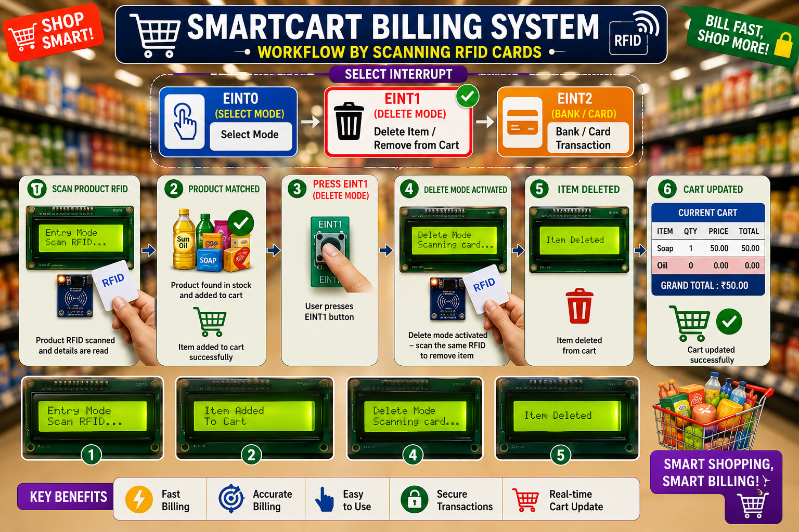
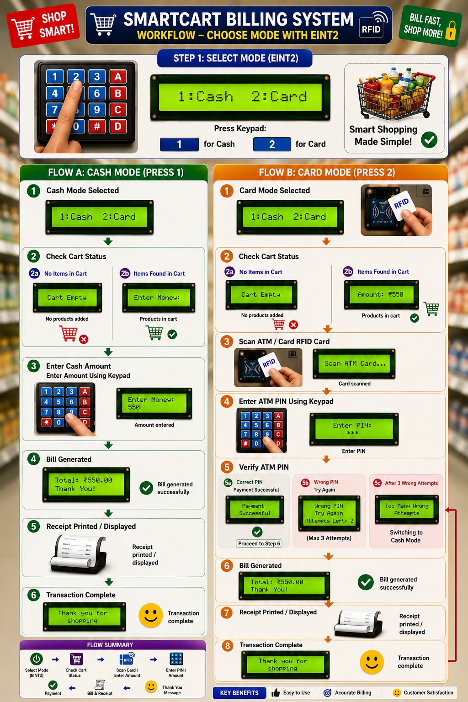

# 🛒 SmartCart – RFID Smart Billing System Using LPC2148 ARM7

       

---
# 📌 Project Description
https://github.com/sangeethakotha194-afk/SMARTCART-RFID-SMART-BILLING-SYSTEM/edit/main/README.md
The **SmartCart – RFID Smart Billing System** is an automated shopping and billing system developed using the **LPC2148 ARM7 microcontroller**, RFID technology, UART communication, and a Linux-based C application.

The system identifies products using RFID cards, manages the shopping cart, updates stock quantities, calculates the total bill, and supports cash and card-based payment processing.

The LPC2148 communicates with the Linux C application through UART, while CSV files are used to maintain product, cart, bank, and sales information.

---
# ✨ Key Features

- 🏷️ RFID-based product identification
- 🛒 Automatic product addition
- ➖ Product removal
- 📦 Stock quantity management
- 💰 Automatic bill calculation
- 👨‍💼 Manager mode
- 💵 Cash payment
- 💳 Card payment
- 🔐 PIN authentication
- 🏦 Bank balance verification
- 📡 UART communication
- 💾 CSV-based database management
- 🧾 Sales transaction storage

 ---
 # 🏗️ System Architecture

---
# 🎯 Objectives

- Automate the traditional billing process
- Identify products using RFID technology
- Reduce manual billing operations
- Add products to the shopping cart
- Remove products from the shopping cart
- Automatically calculate the total bill
- Manage product stock information
- Support cash and card payments
- Validate ATM PIN securely
- Maintain bank account information
- Store completed sales transactions

---

# 🔧 Hardware Requirements

| Component | Purpose |
|------------|---------|
| LPC2148 ARM7 | Main controller |
| RFID Reader | Reads RFID card numbers |
| RFID Cards | Used for product and bank card identification |
| 16×2 LCD | Displays system and billing information |
| 4×4 Keypad | Used for user input and PIN entry |
| Switches | Used for Entry, Delete, and Exit operations |
| MAX232 | Serial communication level conversion |
| USB-to-UART Converter | Communication with Linux PC |
| Power Supply | Provides power to the system |

---
# 📦 Hardware Block Diagram

---
# 💻 Software Requirements

| Software | Purpose |
|----------|---------|
| Embedded C | LPC2148 firmware development |
| Keil μVision | Embedded code development |
| Flash Magic | Programming LPC2148 |
| Linux OS | Billing application execution |
| GCC Compiler | Compiling Linux C application |

---
# ⚙️ System Working Principle

The SmartCart system works through the following process:

1. The user selects the required operation.
2. The RFID card is scanned.
3. The LPC2148 receives the RFID information.
4. The RFID data is transmitted to the Linux application through UART.
5. The Linux application searches the corresponding database.
6. Product or bank information is retrieved.
7. The required operation is performed.
8. The database is updated.
9. The total bill is calculated.
10. The transaction is completed and stored.

---
# 📦 System Working Flow

---
# 🔄 Operating Modes

The SmartCart system uses external interrupts to select different operating modes.

| Interrupt | Operating Mode | Function |
|-----------|----------------|----------|
| EINT0 | Customer / Manager Mode | Add products or manage stock |
| EINT1 | Delete Mode | Remove products from the cart |
| EINT2 | Exit / Checkout Mode | Complete billing through cash or card payment |

# 🛒 EINT0 – Customer / Manager Mode

**EINT0** is used to enter the main operating modes of the SmartCart system.

When the user activates **EINT0**, the system provides two options:

- 🛒 Customer Mode
- 👨‍💼 Manager Mode

The user selects the required mode according to the operation to be performed.
## 🛒 Customer Mode

Customer Mode is used to add products to the shopping cart.

### Working Process

1. User selects Customer Mode through EINT0.
2. The product RFID card is scanned.
3. The LPC2148 reads the RFID number.
4. The RFID number is transmitted through UART.
5. The Linux application searches `stock.csv`.
6. Product information is retrieved.
7. The product is added to the cart.
8. The stock quantity is updated.
9. The total bill is calculated.
10. The updated cart information is stored.

## 👨‍💼 Manager Mode

Manager Mode is used for stock and product management.

The manager can:

- Add new products
- Update existing stock quantities
- Modify product information
- Maintain the product database

The manager selects Manager Mode through the EINT0 operating menu.

---
# 🔄 Operation Selection Process

The **EINT0 interrupt** is used to enter the main operating mode selection.

# ➖ EINT1 – Delete Mode

**EINT1** is used to remove products from the shopping cart.

### Working Process

1. User activates EINT1.
2. The system enters Delete Mode.
3. The product RFID card is scanned.
4. The RFID number is transmitted through UART.
5. The product is searched in the cart.
6. The selected product is removed.
7. The stock quantity is restored.
8. The product price is deducted from the total bill.
9. The cart and stock information are updated.

---
# ➖ Cart Modification Process

The **EINT1 interrupt** is used to remove a product from the shopping cart.

---
# 🚪 EINT2 – Exit / Checkout Mode

**EINT2** is used to exit the shopping process and complete the final billing operation.

When the user activates **EINT2**:

1. The current cart is displayed.
2. The final bill amount is calculated.
3. The system enters the payment selection.
4. The user selects a payment method:

   - 💵 Cash Payment
   - 💳 Card Payment

5. The selected payment is processed.
6. The transaction is completed.
7. The sales record is stored in `sales.csv`.

## 💵 Cash Payment

When Cash Payment is selected:

1. The final bill amount is calculated.
2. The customer selects Cash Payment.
3. The cash transaction is processed.
4. The transaction is completed.
5. The sales information is stored in `sales.csv`.

## 💳 Card Payment

When Card Payment is selected:

1. The customer scans the bank RFID card.
2. The card number is read.
3. The card information is transmitted through UART.
4. The system requests the ATM PIN.
5. The customer enters the PIN.
6. The PIN is validated.
7. The account balance is checked.
8. The bill amount is deducted.
9. The transaction is completed.
10. The sales record is stored in `sales.csv`.

The system provides up to **three PIN attempts** for authentication.

---
# 💳 Payment Process

After completing the shopping process, the system enters the payment process.

---
# ✨ Project Highlights

- LPC2148 ARM7-based embedded system
- RFID-based product identification
- UART communication between embedded system and Linux application
- Product stock management
- Shopping cart management
- Manager stock update facility
- Automatic billing calculation
- Cash payment support
- Card payment support
- ATM PIN validation
- Three-attempt PIN verification
- Bank balance checking
- Database integration using CSV files
- Sales transaction management

---
# 🔄 Complete System Flowchart

---

### UART Configuration

| Parameter | Value |
|-----------|-------|
| Device | /dev/ttyUSB0 |
| Baud Rate | 9600 bps |
| Data Bits | 8 |
| Stop Bits | 1 |
| Parity | None |

---

# 🔒 System Features

- RFID-Based Product Identification
- Automatic Billing
- Real-Time Cart Management
- Product Addition
- Product Deletion
- Automatic Stock Update
- Manager Mode
- Cash Payment
- Card Payment
- PIN Authentication
- Bank Balance Verification
- UART Communication
- CSV Database Integration
- Sales Report Generation

---

# 📷 Project Demonstration

---

# 🎯 Advantages

- Reduces billing time
- Minimizes manual errors
- Reduces customer waiting time
- Provides automatic product identification
- Enables real-time bill calculation
- Provides stock management
- Supports multiple payment methods
- Maintains transaction history
- Provides an automated retail solution
---
# 🚀 Future Enhancements

- QR Code Billing
- Mobile Payment Integration
- Cloud Database
- GSM Bill Notification
- Wi-Fi Connectivity
- IoT-Based Inventory Monitoring
- Mobile Shopping Application

---

# 🌍 Applications

- Smart Shopping Carts
- Supermarkets
- Shopping Malls
- Retail Stores
- Department Stores
- Automated Billing Systems
- Inventory Management

---

# 👩‍💻 Developer

**Kotha Sangeetha**

**Bachelor of Technology**

**Electronics and Communication Engineering**

**2025 Graduate**

---

# 📜 License

This project is developed for **academic and educational purposes**.

Feel free to fork, modify, and improve the project.

---

# 🙏 Thank You

Thank you for visiting this project.
